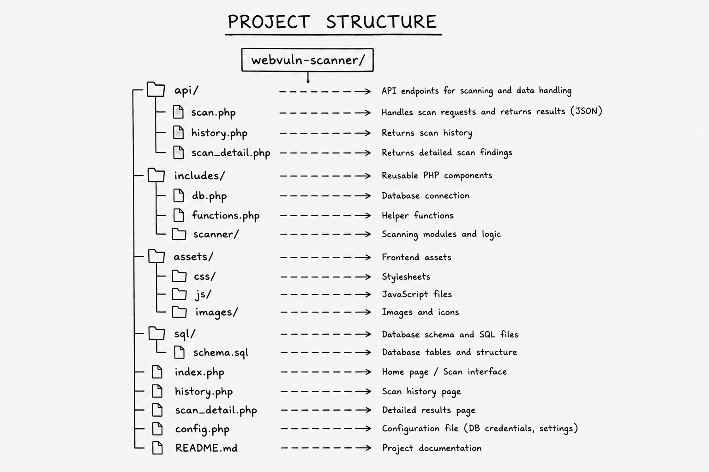
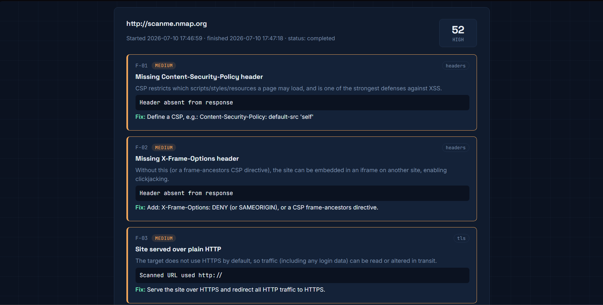
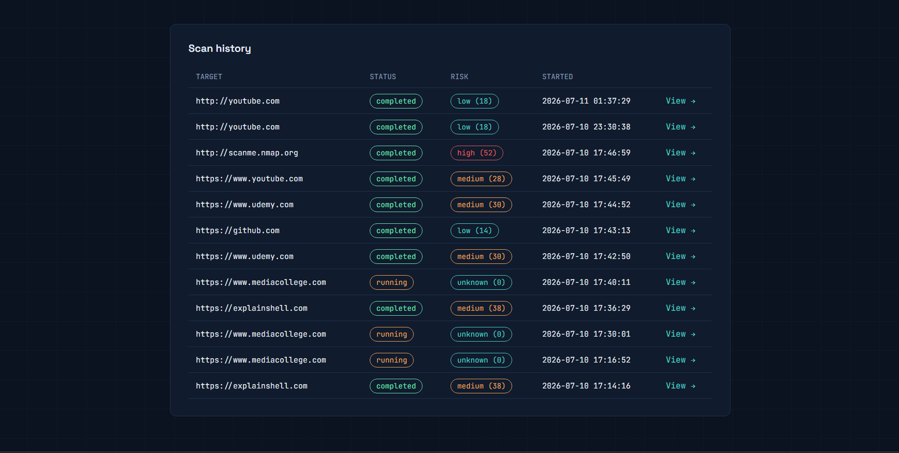
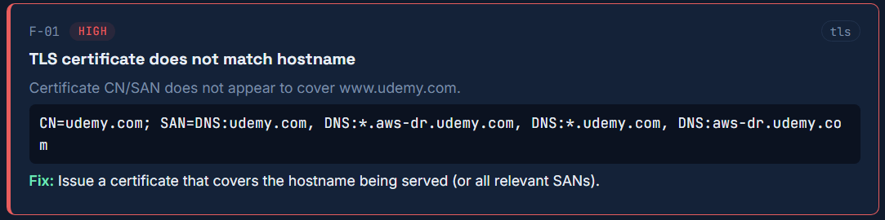

<div align="center">

# WebVuln Scanner

A passive web security scanner built with PHP and MySQL that identifies common website security weaknesses through safe, read-only analysis.

---


</div>

---

# About

WebVuln Scanner is a lightweight web application designed to inspect websites for common security weaknesses without attempting exploitation. Instead of attacking the target, it analyzes publicly available responses and configuration details to help identify potential security risks.

The project was built to demonstrate practical web application security concepts while maintaining a safe, passive scanning approach.

---

# What It Detects

| Component | Checks Performed |
|------------|-----------------|
| HTTP Headers | Missing HSTS, CSP, X-Frame-Options, Referrer-Policy, Permissions-Policy |
| Cookies | Secure, HttpOnly and SameSite validation |
| SSL/TLS | Expired certificates, hostname mismatch, self-signed certificates |
| Fingerprinting | Server software, framework and CMS identification |
| Public Exposure | .env, .git, backup files, phpinfo pages |
| Directories | Open directory listings |
| robots.txt | Sensitive path discovery |
| XSS | Reflected input detection |
| SQL Injection | Error-based SQL exception detection |

---

# Architecture


---

# Built With

| Backend | Frontend | Database |
|----------|-----------|----------|
| PHP | HTML | MySQL |
| Apache | CSS | MariaDB |
| cURL | JavaScript | PDO |

---

# Project Structure



---


# Home Dashboard


# Scan Report


# History Page


# Detailed Findings


```

---

# Design Goals

• Passive Scanning

• Non-destructive Testing

• Simple Deployment

• Browser Interface

• Risk Scoring

• Persistent Scan History

---

# Future Roadmap

- Authentication
- PDF Reports
- Docker Deployment
- REST API
- Scheduled Scanning
- OWASP Mapping
- CVSS Integration

---

# Notice

This project should only be used against systems you own or have explicit permission to assess. It performs passive security checks and is intended for educational purposes and authorized security assessments.

---

<div align="center">

Made by **Abhinav Kumar**

</div>
